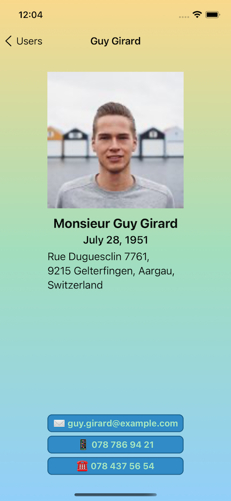

# USERS - generator of random users for iOS
A simple app that uses the fetch API to generate a list of random user profiles.

## Table of Contents
* [Introduction](#introduction)
* [Requirements](#requirements)
* [Installation](#installation)
* [Application Architecture](#application-architecture)
* [Technologies](#technologies)
* [Features](#features)
* [Sources](#sources)
* [Contacts](#contacts)

## Introduction
The **Users** app allows to get information about 100 random created users and to do some simple actions in relation to them.  

 |   
:-------------------------------: | :-------------------------------:
 | 

## Requirements
* Xcode 12.4 or later
* iOS 14.4 or later

## Installation
1. Clone the repository:  
   * using HTTPS:  
`$ git clone https://github.com/milaplatonova/Users.git`
    * using SSH:  
`$ git clone git@github.com:milaplatonova/Users.git`
1. Add Alamofire as a git submodule:  
`$ git submodule add https://github.com/Alamofire/Alamofire.git`
1. Open the project in Xcode:  
`$ open Users.xcworkspace`
1. Choose the **iOS Simulator**, Build and Run the project.

## Application Architecture
Users App follows the Model-View-Controller (MVC) design pattern and uses such app development practices as Storyboard and Auto Layout.

## Technologies
**Table View and Collection View**  
The project provides a way of customizing Table & Collection Views by adding extra opportunities like the following:  
* sorting
* grouping
* filtering
* searching
  
**Tuples**  
Tuples are used to return multiple values from functions: a tuple allows to group together multiple values of different types which can then be returned from a function as a single entity.  
  
**Alerts**  
Alerts are displayed when the app requires additional acknowledgment from the user (confirmation of intention to make a call, to send a message or an e-mail).  

   
  
**Extensions**  
Extensions are used to improve code organization. The code is splitted into separate extension blocks in order to avoid big and messy UIViewController classes.  
  
**MessageUI**  
The MessageUI framework is used for presenting standard composition interfaces for email and SMS text messages.  
  
**Alamofire**  
Alamofire framework is used to make a HTTPS request and parse a JSON respond.  

## Features
* iPhone and iPad realization
* responsive design
* 2 options to represent the list of users:  

 __Table View__ | __Collection View__
:-------------: | :--------------:
 | 

* grouping users into sections by name
* search functionality to filter users by name, city or country:  

 __Table View__ | __Collection View__
:-------------: | :--------------:
 | 

* detailed information by clicking a user
* opportunity to contact a user from the app:  
 :email: to send an e-mail  
 :iphone: to send a message  
 :telephone_receiver: to make a call  

  
## Sources
To retrieve a random user information Users app uses the [Random user generator API](https://randomuser.me), which provides with a JSON object that is then parsed and applied to the Users application.  
  
## Contacts
Lyudmila Platonova  
:email: milaplatonova@icloud.com  
:bust_in_silhouette: [LinkedIn](linkedin.com/in/lyudmila-platonova-916097222)

